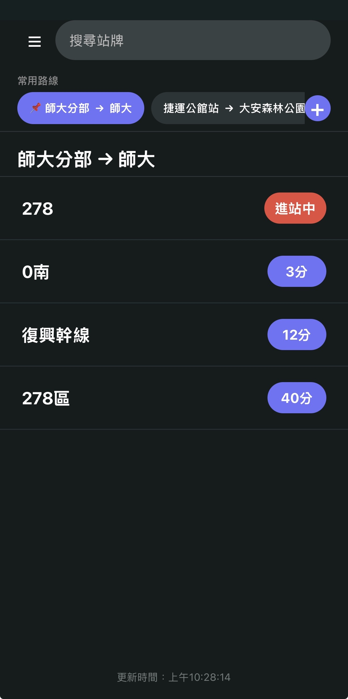

<div align="center">

# 台北公車即時資訊 WebApp

</div>

快速查詢台北市公車即時到站資訊。無需下載 App，用瀏覽器即可使用；支援 PWA 安裝到手機，享受原生 App 體驗。

**線上使用**: [https://expo-bus-route-app.vercel.app](https://expo-bus-route-app.vercel.app)

## 功能特色

### 站牌查詢
搜尋台北市任何公車站牌，即時顯示所有經過該站的公車及到站時間。介面清晰標示公車狀態：進站中、分鐘數計時、未發車等。每 30 秒自動刷新最新資訊，確保到站時間準確。

### 常用路線
儲存經常搭乘的路線，首頁即可快速查看。支援自訂路線名稱（例如「上班路線」）及置頂功能，方便優先查看重要路線。左右滑動快速切換不同路線，快速掌握班次狀況。

### 路線規劃
輸入起點和終點站牌，自動規劃最優路線。顯示公車號、預計車程時間等詳細資訊，幫助使用者快速找到最合適的搭乘方案。

### PWA 安裝
直接在手機主畫面安裝應用，像使用原生 App 一樣便利。支援背景更新及推播通知，即使未開啟瀏覽器也能收到公車到站提醒。

### 推播通知
設定公車即將到站的提醒時間，自動推送通知。支援多個提醒時間設定，客製化個人的提醒方案。

## 使用指南

### 直接使用

1. 用手機或電腦瀏覽器開啟 [https://expo-bus-route-app.vercel.app](https://expo-bus-route-app.vercel.app)
2. 在搜尋欄輸入站牌名稱或選擇常用路線
3. 檢視即時公車資訊並決定搭乘方案

### 安裝到手機 (PWA)

**iPhone/iPad (Safari):**

1. 開啟 https://expo-bus-route-app.vercel.app
2. 點擊下方分享按鈕
3. 選擇「加入主畫面」

**Android (Chrome):**

1. 開啟 https://expo-bus-route-app.vercel.app
2. 點擊位址列右側的「安裝」按鈕，或開啟選單 (...) 選擇「安裝應用程式」
3. 確認安裝

安裝後，應用程式會出現在手機主畫面，開啟速度與原生 App 無異。

## 介面導覽

### 應用介面預覽



*圖: 應用主頁面和站牌詳情頁面展示*

### 主頁面

主頁面分為三個區塊：

1. **搜尋欄**: 輸入站牌名稱快速查詢
2. **常用路線**: 可水平滑動的快速存取欄，顯示已儲存的常用路線。點擊任一路線可快速查看該路線的即時班次
3. **最近查詢**: 顯示最近查詢過的站牌，方便快速重複查詢

### 站牌詳情頁面

顯示該站牌所有經過公車的即時資訊，以列表形式呈現：

| 公車號 | 狀態 | 說明 |
|-------|------|------|
| A1 | 進站中 | 公車正在進站或已到站 |
| 307 | 5 分 | 預計 5 分鐘後到達 |
| 211 | 12 分 | 預計 12 分鐘後到達 |
| 280 | 未發車 | 班次尚未開始運行 |
| 225 | 末班已過 | 該班次已結束營運 |

頁面頂部提供「刷新」按鈕以手動更新資訊，自動更新會每 30 秒執行一次。

### 常用路線管理

**新增常用路線**: 在站牌查詢頁面，選擇起點和終點後，點擊星形圖示加入常用

**編輯常用路線**: 長按常用路線卡片可進行：
  - 重新命名（例如將「台大 → 松山」重名為「回家路線」）
  - 置頂該路線，優先顯示
  - 刪除路線

**切換路線**: 常用路線頁面支援左右滑動快速切換，或點擊路線名稱直接切換

## 到站時間說明

應用使用台北市公車動態資訊系統提供的資料：

- **進站中/即將進站**: 公車正在進站或已到站，請立即上車
- **分鐘數 (如 5 分)**: 預估到站時間，以分鐘計
- **未發車**: 班次尚未開始運行（通常為夜間班次）
- **末班已過**: 該班次已結束營運
- **今日未營運**: 該班次今日暫停運行

## 技術細節

### 架構

本應用使用 Expo 框架搭配 React Native 開發，透過 `expo export` 編譯為 Web 平台。

**前端框架:**
- React Native 0.81.4
- Expo SDK 54.0.13
- expo-router v6.0.12 (路由管理)
- TypeScript (型別安全)

**構建與部署:**
- expo export --platform web (Web 編譯)
- Vercel (生產部署)
- PWA (manifest.json, service worker, 離線支援)

### 資料來源

應用使用台北市政府公開的公車動態資訊 API：

- 站牌及路線資訊: 靜態路由資料庫
- 即時到站資訊: 台北市公車動態資訊系統
- 自動更新: 前端邏輯每 30 秒拉取一次最新資訊

### 核心功能實現

**排序邏輯 (utils/routeSorter.ts):**

公車班次按以下優先順序排列：
1. 進站中/即將進站 (rawTime = -1)
2. 依數字時間升序 (最近的班次優先)
3. 終止營運班次列於末尾

**自動刷新 (app/stop.tsx):**

- 使用 React Hook useEffect 管理定時更新
- 30 秒更新一次站牌資訊
- 智能合併新舊資料，避免有效班次被異常狀態覆蓋
- 提供手動刷新按鈕用於即時更新

**常用路線管理 (components/favoriteRoutes.ts):**

- 基於 AsyncStorage 的本地資料庫
- 支援路線儲存、重命名、置頂功能
- 路線快取機制提升查詢速度

### 響應式設計

應用支援各種裝置尺寸：

- **桌面** (寬度 ≥ 768px): 雙欄佈局，側邊選單，全屏顯示
- **手機** (寬度 < 768px): 單欄佈局，底部導覽，垂直滾動

使用 React Native 的 Dimensions API 偵測視埠寬度，動態調整佈局。

### 本地開發

clone倉庫並安裝依賴:

```bash
git clone https://github.com/Fizzy143/expo-Bus-Route-App.git
cd expo-Bus-Route-App
npm install
```

啟動開發伺服器:

```bash
npm run dev
```

編譯為 Web 應用:

```bash
npm run build:web
```

編譯後的文件位於 `dist/` 目錄。

### 構建與部署

**編譯:**

```bash
expo export --platform web
node scripts/copy-icons.js        # 複製 PWA 圖示
node scripts/add-pwa-meta.js      # 添加 PWA meta 標籤
```

**部署:**

應用使用 Vercel 自動部署。`vercel` 分支為生產環境，任何推送至該分支的提交會自動觸發構建與部署。

## 支持

如有任何問題或建議，歡迎在 [GitHub Issues](https://github.com/Fizzy143/expo-Bus-Route-App/issues) 上報告。

---

## 💡 使用小技巧

1. **快速查詢**
   - 直接在搜尋框輸入站牌名（支援模糊搜尋）
   - 或點擊「常用路線」快速查看

2. **自訂常用路線名稱**
   - 長按常用路線 → 選擇「重新命名」
   - 例如：「上班路線」、「回家路線」

3. **離線使用**
   - 安裝為 PWA 後可離線瀏覽已查詢過的站牌
   - 新資訊需要網際網路連線

4. **推播通知設定**
   - 進入主頁 → 點擊通知設定 ⚙️
   - 選擇想要的提醒時間

---

## 🔧 技術細節

### 開發環境設置

1. **安裝依賴**
   ```bash
   npm install
   ```

2. **啟動開發伺服器**
   ```bash
   npx expo start
   ```

3. **建置 Web 版本**
   ```bash
   npm run build:web
   ```

### 專案結構

```
app/                      # 頁面（file-based routing）
  ├── index.tsx          # 主頁 - 站牌查詢與常用路線
  ├── route.tsx          # 路線規劃
  ├── search.tsx         # 站牌搜尋
  ├── stop.tsx           # 站牌詳情
  ├── map.tsx            # 地圖（Web）
  └── map.native.tsx     # 地圖（Native）

components/              # 核心元件
  ├── busPlanner.ts      # 公車資料服務
  ├── favoriteRoutes.ts  # 常用路線管理
  ├── InstallPWA.tsx     # PWA 安裝提示
  └── ServiceWorkerRegister.tsx

databases/               # 資料檔案
  ├── stops.json         # 站牌資訊
  └── stop_id_map.json   # 站牌 ID 對照表

public/                  # PWA 靜態資源
  ├── service-worker.js  # 離線快取
  └── manifest.json      # 應用程式配置
```

### 技術棧

- **框架**：Expo 54 + React Native 0.81
- **路由**：expo-router (file-based routing)
- **狀態管理**：React Hooks + AsyncStorage
- **地圖**：react-native-maps
- **PWA**：Service Worker + Web App Manifest
- **部署**：Vercel（自動從 GitHub 部署）

### 核心功能實現

**公車資料排序**：
- 優先顯示「進站中」的公車
- 其次是按分鐘數升序排列
- 最後是「未發車」等非運行班次
- 相同班次按路線名稱排序

**自動更新機制**：
- 站牌詳情頁：每 30 秒自動刷新
- 常用路線頁：每 30 秒自動刷新
- 智慧合併：舊資料有效時保留，新資料無效時不覆蓋

**Web 與 Native 差異處理**：
- PagerView Mock：模擬 Native ViewPager 的水平滾動
- 響應式設計：768px 為行動設備判斷線 
- 平台特定檔案：map.tsx (Web) vs map.native.tsx (Native)


